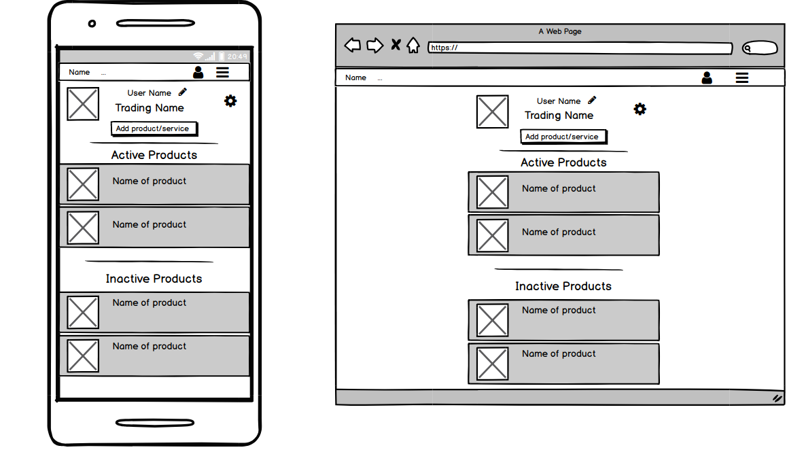
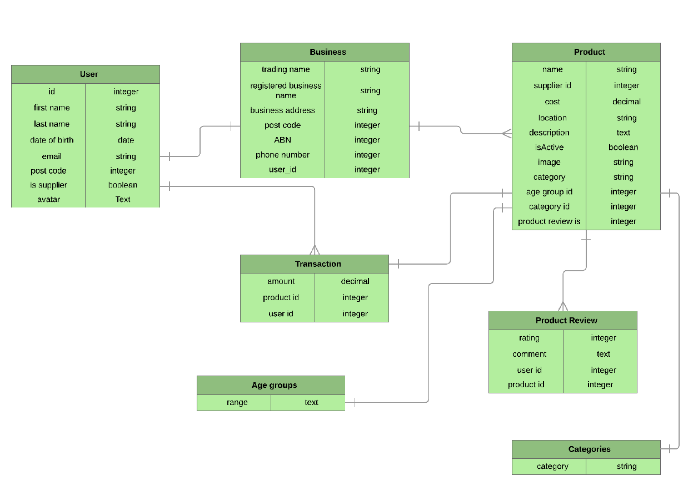

# README

# EXPERIENT

[Github](https://github.com/Santosh2167/experient)
[Heroku](https://cryptic-sierra-61060.herokuapp.com/)

---

## Description
### Problem definition/purpose
With Experient, we are creating a way for business to add their products/services which will be made available for users to purchase and experience. Experient is a database of local experiences with users who are looking for specific experiences that are available and our service allows businesses to have another advertising avenue. We wanted to create a website that acts as a one-stop-shop for those looking to purchase specific experiences as we found that searching for local experiences can take you through many different websites until you find something suitable.

### Functionality/features
A user of Experient can search through the database of experiences to find something suitable to what they are looking for. There are the options to sign up as a suppier or as a user. The supplier has the ability to add the experiences they have to offer, while the user can view those experiences available and have the ability to purchase whichever experience they like. It offers features such as account creation and customisation, advanced searching through parameters (such as price, age-group, keywords and category), ability to make a purchase directly on our website through the use of Stripe, viewing reports for both the user (showing purchases made) and the supplier (showing which products were purchased and when), ability for suppliers to create and edit services and gives the user the ability to give the experience they bought a rating and comment.

### Screenshots


### Tech stack
Experient was made with Ruby on Rails as the foundation. Ruby was the main code for the back-end that the application was written in and there is a mix of ruby, HTML and css for the front-end. Github was used for source control and the application was deployed on Heroku.

### Instructions
Experient allows a user to search through available experiences without having an account, however in order to make a purchase, an account is required. If you wish to sign up as a user, simply click "sign up" on the home page and fill out all fields. If you wish to sign up as a supplier, also click "sign up", but change the "Class" field in the registration form to "I am a supplier", which will then take you to another registration form to fill out business details. Once an account has been created as a user, you can search through experiences, click on one you are interested in and make a purchase. As a supplier, if you head to the profile page, you can add a product/service that you want to offer. You will be prompted with a form with all fields required, then once created, that product/service will be available for all users to purchase.

---

## Design Documentation
### Design Process
The design process was based off similar applications. We drew inspiration from Red Balloon, Groupon and Scoopon. After looking through each website, we took bits and pieces that we liked from each and created wireframes based on those bits that we liked. The design changed as we discussed how a user would interact with the website as well as the want to have an aesthetically pleasing application. A moodboard was created on pinterest with multiple different colour schemes that we liked the look of.


### User Stories
* As a user, I want to create an account to save relevant information and preferences.
* As a user, I want to be able to search for products/services I am interested in.
* As a user, I want to be able to change account details/login credentials.
* As a user, I want to be able to leave a review for the products/services I experienced.
* As a user, I want to be able to view the list of products I have purchased.
* As a user, I want to be able to view the products I purchased in the past.
* As a user, I want to be able to delete my account.
* As a user, I want to be able to search for products/services based on particular parameters such as price, location and age.
* As a supplier, I want to be able to register my business details.
* As a supplier I want to be able to add new products/services for users to purchase/view.
* As a supplier, I want to be able to change my account details.
* As a supplier, I want to be notified once a user has purchased my product.
* As a supplier, I want to be able to make my products inactive.
* As a supplier, I want to be able to view past listings.
* As a supplier, I want to be able to edit current listings.
* As a supplier, I want to be able to view a report on a timed basis.
* As a supplier, I want to be able to delete my account.

### Workflow Diagram


### Wireframes





### Database Entity Relationship Diagrams


---

## Details & planning
We brainstormed the idea and finally decided on a market place where user can buy and sell services and products similar to redballoon.com.au or groupon.com.au.
We then divided the work based on the team member's interest and area of strength. We decided to spend a day or half on exploring the area we are working on (reading materials or watching class videos).

We divided the time line to get the work done. Every day standups where very handy to get updated on team member's work. All of us finished what we initially promised on the timeline.


---

## Short Answer

>>1. What is the need (i.e. challenge) that you will be addressing in your project?

Creating a platform where you are both buyer and seller, all users can buy and sell a product is a challenge we are addressing. Creating a table to hold both buyer and seller data with a flag to identify them and each time a user logs in, validate that flag and display appropriate information on pages was a challenge. 

>> 2. Identify the problem you’re trying to solve by building this particular marketplace App? Why is it a problem that needs solving?

With Experient, we are creating a way for business to add their products/services which will be made available for users to purchase and experience. Experient is a database of local experiences with users who are looking for specific experiences that are available and our service allows businesses to have another advertising avenue. 

We wanted to create a website that acts as a one-stop-shop for those looking to purchase specific experiences as we found that searching for local experiences can take you through many different websites until you find something suitable.

>>3. Describe the project will you be conducting and how. your App will address the needs.

Experient is a database of users (looking for experiences they can purchase) and businesses (adding experiences for the users to view and purchase. The user is able to search for experiences based on parameters such as price, location, keywords, category and age range, ensuring that they are presented with the most suitable experiences on offer. The businesses can add their available experiences and also the parameters associated with each which will help them display their experience to specific users.

>>4. Describe the network infrastructure the App may be based on.
The network it works on is Heroku and Puma. 

Puma : App uses web server called Puma. Puma is a small library that provides a very fast and concurrent HTTP one on one server for Ruby application. It is designed to run rails projects only.  

Heroku: It is a cloud platform that lets users build, deliver, monitor, and scale apps. Heroku assigns a domain once app is deployed into the cloud. Hence the page is quickly available for the users to view and use. So Heroku enables developers on focusing on developing and deploying the application and immediately start producing a value. 

>>5. Identify and describe the software to be used in your App.
Software that we use to build this app is Ruby on Rails. 

Ruby on Rails is a open source software (cost effective) which is very ideal for learning purpose. It follows a standardized file storage (consistent) that keeps project structure and reliable. Rails magic helps to quickly build a complex projects (time efficient). It is scalable. There is a huge community supporting Rails (lots of support) developers (blogs and medium). Plus Ruby on Rails documentations is very rich which makes is so easy to use.

>> 6. Identify the database to be used in your App and provide a justification for your choice.
The databse we are using on this project is Postgresql. 

Postgresql is a open source databse with a strong community support. It also has a strong third party support.

If the need be, It is possible to extend PostgreSQL programmatically with stored procedures, like an advanced RDBMS.

It is not only a relational databsae but it is objective too – it supports nesting and more. 

PostgreSQL is available for almost every operating system, 34 platforms with the latest stable release, and Windows compatibility is available via the Cygwin framework. 

>> 7. Identify and describe the production database setup (i.e. postgres instance).
We have seeded data from Fake gem to get dummy data in our database. We are keeping the seeding on in this instance as we need some data to make the presentation 

Production databse a databse ready to go live. Anything on the production database will be visible to the world. Usually database in the development stage has some test data and when it is deployed to Heroku then they are taken off the database and database is empty. 


>> 8. Describe the architecture of your App.
Our app follows MVC (Model View Controller) architecture. We have chosen Ruby on Rails to build the application and used various gems like Devise, Carrierwave, Faker, Stripe. We have used git for the control version.

In MVC model, scripts are grouped based on its purpose. Model will hold all the data related scripts (dealing with databse, there is a model for each table in the database). 

Views will hold no logic at all and just script (html and ruby for for loop and if condition) and no other logic.

Controller sits in the middle of Model and View. And holds all the logics. It makes varialble (and data variable holds) available to and from Model and View.  

>> 9. Explain the different high-level components (abstractions) in your App.
Some of the high level components (abstractions) we have used are Devise gem, Stripe API and AWS API.

Devise gem is a package that helps on user profile creation, verification and authentication. 

Stripe API helps to process Credit Card transaction. Developer does not have to worry about Credit Card processing, verification and transaction data storage after successfully hooking up Stripe API in the application.

AWS API helps on storing images in the cloud. It takes away all the abstraction on image storage and management. 

We have also used MVC Movel in which scripts are grouped based on its purpose as described below:
Model will hold all the data related scripts (dealing with databse, there is a model for each table in the database). 
View holds script related to displaying the data (html with Ruby embedded), it does not have any logic except for if and for (.each) loop.
Controller acts as middle man between View and Model. It takes request from the user and passes the requrest either to View or Model depending on the user’s need.  


>> 10. Detail any third party services that your App will use.
One of the thrid party app that we have used is Stripe API.

Stripe API helps developer to hook up their app with Stripe so that they can use functionality of Stripe. Stripe is a service that allows user to accept payment online. With the Stripe application, users can keep track of payments, search past payments, create recurring charges, and keep track of customers.
Some example API methods include sending invoices, accepting payments, managing subscription billing, and editing and managing account information.

>> 11. Describe (in general terms) the data structure of marketplace apps that are similar to your own (e.g. eBay, Airbnb).
We are picking up Airbnb and navigating through its site to figure out the datastructure they might have kept.

One of the tables they have is User table that holds personal data of the user. Detail of the host information is another table. Transaction table is the next table AirBnB holds. It also has Review table to hold reviews of your stay. It has lots of photos, so AirBnB must be using a table or outsourced vendor (like AWS) to save their photos. 
They have FAQ section

Relationship would be 
1. One user can have many transaction. One transaction belongs to one user
2. One host can have many transaction. One transaction belongs to one host
3. One User can put many Reivew. One Review belongs to one User
4. One user can have many images, One image belongs to one User


>>12. Discuss the database relations to be implemented.
When naming tables and colums, we have tried to name them to make sense on why they are for as much as possible.  

Business Table
One of the tables is Business Table. As name suggests, it holds data for the business. We had a look on signing up form for business for similar website (www.redballoon.com.au) and created the table which is as below:

BUSINESS
Trading Name
String
Registered_business_name
String
Business_address
String
Post_code
Integer
ABN
Integer
Phone_Number
Integer
User_id
integer

We have User_id as in this table to establish relationship with User table. One user can have one business.

Category Table
We have categories for product that seller will post in the website.This table holds data on categories.

CATEGORIES 
Category
String

Category cane be Advanture, Dining, out door games, film etc. We have to create a separate table because this helps on not repeting data in the product table. Product table will have category id which will indicate which category that product belongs to. 

User Table
User table holds data on User. This is a table created by Devise gem, which we leter extended to meet our app requirements. 


USER
First name
String
Last name
String
Date of birth
Date
Email
String
Post code
Integer
isSupplier
Boolean
Avatar
Text
Password
String
Password_token
String
Customer_id
String

Product Table

Product Table holds data about the product that supplier uploads to sell. 
It has User_id because, user can be a supplier when a user is also a supplier then one user can have multiple products. 

PRODUCT
Name
String
Cost
Decimal
Location
String
Description
Text 
Active
Boolean
Category_id
Integer
Keywords
Text
User_id
Integer
Age_group_id
Integer

It has Category_id which is linking this table to Category table. One product belongs to one Category.

It has Age_group_id which links it to Age Group table. One product appeals to one age group. 

Product Review Table

Product review holds review on the product that buyer has experienced.  It is User_id which links this table to User (buyer). One Product Review belongs to one User and one User can write review for multiple product. Hence it is one to many relationship.

PRODUCT REVIEW
Rating
Integer
User_id
Integer
Transaction ID
Integer
Comment
Text

It has Transaction ID which links Product Review table to Transaction table. It tracks which review belong to which transaction. 

Having Transaction ID and User ID on this table makes this table a complete table. 

Transaction Table
This holds all the detail on the purchases user makes through the website. 


TRANSACTION
User_id
Integer
Product_id
Integer
Quantity
Integer
Amount
Decimal

It holds User_Id, this links transaction to user. One user can have multiple transactions and one transaction belongs to one user. 

It holds Product_id, this links transaction to Product. One product can have multiple transactions but one transaction will belong to one product. 

Quantity will let us know how many products were bought by the user in quantity. Amount will tell us on the total amount of the transaction. 

Age Group Table
This table holds Age Group. Rather than repeating data in other tables we chose to keep a separate table for Age Group. 


 AGE GROUP
Range
Text

Product belongs to one age group. So it is linked to the product table. 


>>13. Describe your project’s models in terms of the relationships (active record associations) they have with each other.
Models we have in our application are as follows:

age_group.rb
This table holds age group which is used to classify products based on the age group.
Relationship is as follows:
```
class AgeGroup < ApplicationRecord
has_many :products
end
```
business.rb
This table holds data on business.
Relationship is as follows:
```
class Business < ApplicationRecord
belongs_to :user
validates :trading_name, :registered_business_name, :business_address, :post_code, :abn, :phone_number, presence: true
validates :post_code, numericality: { only_integer: true }, length: { is: 4 }
validates :abn, numericality: { only_integer: true }
validates :phone_number, numericality: { only_integer: true }
end

category.rb
This holds category that product belongs to.
Relationship as follows:

class Category < ApplicationRecord
has_many :products
end

product_review.rb
This holds review on product that user has bought and enjoyed. 
Relationship as follows:

class ProductReview < ApplicationRecord
belongs_to :user
belongs_to :trans, class_name: 'Transaction', foreign_key: 'transaction_id'
validates :comment, presence: true
validates :rating, presence: true, numericality: { only_integer: true, :greater_than => 0, :less_than => 6 }, length: { is: 1 }
end
```
product.rb
This holds all the products supplier has uploaded. 
Relationship is as follows:
```
class Product < ApplicationRecord
belongs_to :user

belongs_to :age_group
belongs_to :category
has_many :transactions
mount_uploader :image, ImageUploader

end

transaction.rb
This table holds data on transaction.
Relationship is as follows:
class Transaction < ApplicationRecord
belongs_to :product
belongs_to :user
has_one :product_review
end
```
user.rb

This table holds data one User. 
Relationship is as follows:
```
class User < ApplicationRecord
# Include default devise modules. Others available are:
# :confirmable, :lockable, :timeoutable, :trackable and :omniauthable
mount_uploader :avatar, AvatarUploader
devise :database_authenticatable, :registerable,
:recoverable, :rememberable, :validatable
validates :first_name, :last_name, :email, :password, :post_code, :date_of_birth, presence: true
validates :post_code, numericality: { only_integer: true }, length: { is: 4 }
# has_many :interests, as: :categorable

has_one :business
has_many :product_reviews
has_many :transactions
end
```
>>14. Provide your database schema design.

Following is the ERD diagram.
Schema page can be found below this diagram.


Following is the detail of the schema page:

```ActiveRecord::Schema.define(version: 2018_11_08_000950) do

# These are extensions that must be enabled in order to support this database
enable_extension "plpgsql"

create_table "age_groups", force: :cascade do |t|
t.text "range"
t.datetime "created_at", null: false
t.datetime "updated_at", null: false
end

create_table "businesses", force: :cascade do |t|
t.string "trading_name"
t.string "registered_business_name"
t.string "business_address"
t.integer "post_code"
t.integer "abn"
t.integer "phone_number"
t.datetime "created_at", null: false
t.datetime "updated_at", null: false
t.bigint "user_id"
t.index ["user_id"], name: "index_businesses_on_user_id"
end

create_table "categories", force: :cascade do |t|
t.string "category"
t.datetime "created_at", null: false
t.datetime "updated_at", null: false
end

create_table "product_reviews", force: :cascade do |t|
t.integer "rating"
t.text "comment"
t.bigint "user_id"
t.datetime "created_at", null: false
t.datetime "updated_at", null: false
t.bigint "transaction_id"
t.index ["transaction_id"], name: "index_product_reviews_on_transaction_id"
t.index ["user_id"], name: "index_product_reviews_on_user_id"
end

create_table "products", force: :cascade do |t|
t.string "name"
t.decimal "cost"
t.string "location"
t.text "description"
t.boolean "active"
t.string "category"
t.text "keywords"
t.bigint "user_id"
t.datetime "created_at", null: false
t.datetime "updated_at", null: false
t.string "image"
t.bigint "age_group_id"
t.bigint "category_id"
t.index ["age_group_id"], name: "index_products_on_age_group_id"
t.index ["category_id"], name: "index_products_on_category_id"
t.index ["user_id"], name: "index_products_on_user_id"
end

create_table "transactions", force: :cascade do |t|
t.decimal "amount"
t.bigint "product_id"
t.bigint "user_id"
t.datetime "created_at", null: false
t.datetime "updated_at", null: false
t.index ["product_id"], name: "index_transactions_on_product_id"
t.index ["user_id"], name: "index_transactions_on_user_id"
end

create_table "users", force: :cascade do |t|
t.string "email", default: "", null: false
t.string "encrypted_password", default: "", null: false
t.string "reset_password_token"
t.datetime "reset_password_sent_at"
t.datetime "remember_created_at"
t.datetime "created_at", null: false
t.datetime "updated_at", null: false
t.string "first_name"
t.string "last_name"
t.date "date_of_birth"
t.integer "post_code"
t.boolean "is_supplier"
t.string "avatar"
t.string "provider"
t.text "image"
t.string "customer_id"
t.index ["email"], name: "index_users_on_email", unique: true
t.index ["reset_password_token"], name: "index_users_on_reset_password_token", unique: true
end

add_foreign_key "businesses", "users"
add_foreign_key "product_reviews", "transactions"
add_foreign_key "product_reviews", "users"
add_foreign_key "products", "age_groups"
add_foreign_key "products", "categories"
add_foreign_key "products", "users"
add_foreign_key "transactions", "products"
add_foreign_key "transactions", "users"
end
```
>>15. Provide User stories for your App.
Following is the user story for our app:

User Stories
    • As a user, I want to create an account to save relevant information and preferences. 
    • As a user, I want to be able to search for products/services I am interested in. 
    • As a user, I want to be able to change account details/login credentials. 
    • As a user, I want to be able to leave a review for the products/services I experienced. 
    • As a user, I want to be able to view the list of products I have purchased. 
    • As a user, I want to be able to view the products I purchased in the past. 
    • As a user, I want to be able to delete my account. 
    • As a user, I want to be able to search for products/services based on particular parameters such as price, location and age. 
    • As a supplier, I want to be able to register my business details. 
    • As a supplier I want to be able to add new products/services for users to purchase/view. 
    • As a supplier, I want to be able to change my account details. 
    • As a supplier, I want to be notified once a user has purchased my product. 
    • As a supplier, I want to be able to make my products inactive. 
    • As a supplier, I want to be able to view past listings. 
    • As a supplier, I want to be able to edit current listings. 
    • As a supplier, I want to be able to view a report on a timed basis. 
    • As a supplier, I want to be able to delete my account


16. Provide Wireframes for your App.


>>17. Describe the way tasks are allocated and tracked in your project.

The process of allocating the tasks for each member of the team started out in Trello. We wrote up the user stories, then disected each story into the feature(s) that would have to be created for each. After writing out all the features that had to be completed, we then discussed amongst ourselves what we would like to do. Initially we were going to tackle the tasks that we didn’t have the best understanding of in order to build our knowledge, however we decided it would be best to work on our strengths at first, but also create code that we can then explain fully to each member of the team.


>>18. Discuss how Agile methodology is being implemented in your project.

Agile methodology helped us to create the application as it currently is. We have kept customer at the center during the app development. We started with User Stroies by putting ourselves in a user’s shoe and listed all the features and functions that a user wants. 
We then listed out Supplier’s Story and listed all the features and functions that a supplier wants. 

When scripting we always thought and discussed among the team members how user would interact (or use) what we have scripted and tried to  script on as user friendly way as possible. Same goes with Supplier section. 

By segregating the workflow amongst the team, we were able to divide each required feature into smaller tasks and we worked on such tasks next to one another. Although we believed we had all relationships covered in each ERD, we realised throughout the course of the development process that categories and relationships had to be modified, created or deleted. 

>>19. Provide an overview and description of your Source control process.

The source control process was maintained through the use of git branches. Each necessary feature was worked on in its individual branch. These branches were used to help keep the code for a particular feature away from the master code until the feature had been completed. When one of the team had code that was ready to merge into the master branch, we would put our current code on pause and work through any merge conficts (if any did arise) to ensure we all had an understanding of the changes that were being made to the master code.

>>20. Provide an overview and description of your Testing process.

The testing process was performed over 3 stages. The first was when a feature was tested in its separate branch. The person who developed the feature would make sure it worked in the branch before merging it into the master branch. Once satisfied with the individual branch and merged into master, it was tested again to make sure that there were no issues cause from that merge. The third test was created in the form of an excel spreadsheet, where we would state the task the feature was meant to perform and we would confirm/deny whether that task was able to be carried out correctly.

>>21. Discuss and analyse requirements related to information system security.

Following were the security concenrs when building the app
Keeping personal information safe
We are collecting personal information during the sign up. We are also keeping track of transactions of individuals (i.e. purchasing behaviour). Hence rather than storing data in a text file or access, we have chose Postgresql, a good database with robust security.

Keeping financial information safe 
Credit Card information is very sensitive information and it needs proper care and look after. Hence we have stored all the financial information in Stripe. Stripe is good on managing such sensitive information. 

Keeping password safe
We have gem called Devise that handles signing in of the user by keeping data encrypted in the database. Hence there is not chance of password leakage. 

Keeping data transfer safe:
When saving data from web to database we have not done mass assignment. We have rather taken a safe step to prevent possible sql injection in the middle of the data transfer from app to database. 
.params.require[:table].permit(:column1, :column2, :column3)


>>22. Discuss methods you will use to protect information and data.

Rails uses Bcrypt to protect password in the database which is a robust hashing system

Cross-Site Request Forgery (CSRF) is an attack that allows a malicious user to spoof legitimate requests to your server, masquerading as an authenticated user. Rails protects against this kind of attack by generating unique tokens and validating their authenticity with each submission.

We have not used hidden field to get the price of the product we are selling which can be manipulated by the hacker 

>>23. Research what your legal obligations are in relation to handling user data.

Australia has a scrict law when it comes to financial and personal data handling. Privecy Act 1988 requires all data to be handled securely. Considering this requirment, we have chosed a good robust databse named Postgres to install all the data. 

We have chosen Rails that uses Bcrypt and had CSRF function to store password and to handle cross site data request

We have used Stripe to store all the financial data (like storing credit card information, charging credit card etc)

