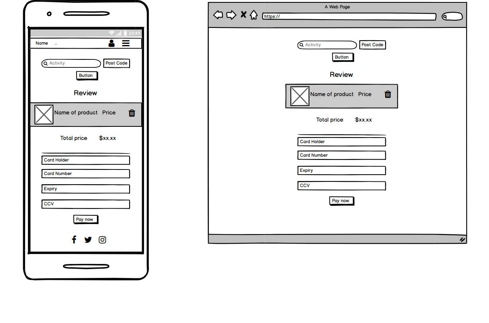

# README

# EXPERIENT

[Github](https://github.com/Santosh2167/experient)
[Heroku]

---

## Description
### Problem definition/purpose
With Experient, we are creating a way for business to add their products/services which will be made available for users to purchase and experience. Experient is a database of local experiences with users who are looking for specific experiences that are available and our service allows businesses to have another advertising avenue. We wanted to create a website that acts as a one-stop-shop for those looking to purchase specific experiences as we found that searching for local experiences can take you through many different websites until you find something suitable.

### Functionality/features
A user of Experient can search through the database of experiences to find something suitable to what they are looking for. There are the options to sign up as a suppier or as a user. The supplier has the ability to add the experiences they have to offer, while the user can view those experiences available and have the ability to purchase whichever experience they like. It offers features such as account creation and customisation, advanced searching through parameters (such as price, age-group, keywords and category), ability to make a purchase directly on our website through the use of Stripe, viewing reports for both the user (showing purchases made) and the supplier (showing which products were purchased and when), ability for suppliers to create and edit services and gives the user the ability to give the experience they bought a rating and comment.

### Screenshots

### Tech stack
Experient was made with Ruby on Rails as the foundation. Ruby was the main code for the back-end that the application was written in and there is a mix of ruby, HTML and css for the front-end. Github was used for source control and the application was deployed on Heroku.

### Instructions
Experient allows a user to search through available experiences without having an account, however in order to make a purchase, an account is required. If you wish to sign up as a user, simply click "sign up" on the home page and fill out all fields. If you wish to sign up as a supplier, also click "sign up", but change the "Class" field in the registration form to "I am a supplier", which will then take you to another registration form to fill out business details. Once an account has been created as a user, you can search through experiences, click on one you are interested in and make a purchase. As a supplier, if you head to the profile page, you can add a product/service that you want to offer. You will be prompted with a form with all fields required, then once created, that product/service will be available for all users to purchase.

---

## Design Documentation
### Design Process
The design process was based off similar applications. We drew inspiration from Red Balloon, Groupon and Scoopon. After looking through each website, we took bits and pieces that we liked from each and created wireframes based on those bits that we liked. The design changed as we discussed how a user would interact with the website as well as the want to have an aesthetically pleasing application. A moodboard was created on pinterest with multiple different colour schemes that we liked the look of.

### User Stories
* As a user, I want to create an account to save relevant information and preferences.
* As a user, I want to be able to search for products/services I am interested in.
* As a user, I want to be able to change account details/login credentials.
* As a user, I want to be able to leave a review for the products/services I experienced.
* As a user, I want to be able to view the list of products I have purchased.
* As a user, I want to be able to view the products I purchased in the past.
* As a user, I want to be able to delete my account.
* As a user, I want to be able to search for products/services based on particular parameters such as price, location and age.
* As a supplier, I want to be able to register my business details.
* As a supplier I want to be able to add new products/services for users to purchase/view.
* As a supplier, I want to be able to change my account details.
* As a supplier, I want to be notified once a user has purchased my product.
* As a supplier, I want to be able to make my products inactive.
* As a supplier, I want to be able to view past listings.
* As a supplier, I want to be able to edit current listings.
* As a supplier, I want to be able to view a report on a timed basis.
* As a supplier, I want to be able to delete my account.

### Workflow Diagram

### Wireframes

### Database Entity Relationship Diagrams

---

## Details & planning

